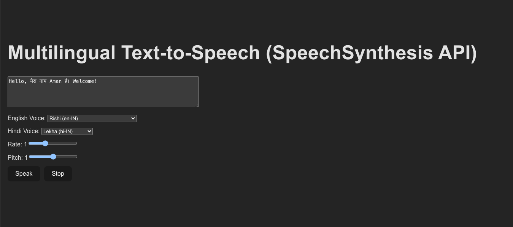

# Multilingual Text-to-Speech Applications

A collection of **two web-based Text-to-Speech (TTS) applications** designed to convert multilingual text (English + Hindi) into speech. Both apps allow users to type text and listen to it spoken aloud, but differ in **implementation, capabilities, and quality**.

---

## Overview

* **App1:** Lightweight, fully frontend-based TTS app using the **browser's SpeechSynthesis API**.
* **App2:** Self-deployed, open-source TTS solution with a backend, providing **high-quality voices** and greater control.

---

## Table of Contents

* [App1: Browser SpeechSynthesis TTS API](#app1-browser-speechsynthesis-tts-api)
* [App2: Self-Deployed Open-Source TTS](#app2-self-deployed-open-source-tts)
* [Tech Stack](#tech-stack)
* [Folder Structure](#folder-structure)
* [Installation & Run](#installation--run)
* [License](#license)
* [Acknowledgments](#acknowledgments)

---

## App1: Browser SpeechSynthesis TTS API

**Overview:**
App1 is a **React-based, frontend-only** application that leverages the browser’s **SpeechSynthesis API**. It’s lightweight, quick to use, and requires no backend.

**Key Features:**

* Supports **English + Hindi** text.
* Select available **voices** for English and Hindi.
* Adjustable **speech rate** and **pitch**.
* **Start/Stop controls** for speaking.
* Fully **client-side**, no server needed.

**How it Works:**

1. User types text in the textarea.
2. The app **splits text** into Hindi (Devanagari) and English segments.
3. It assigns **appropriate voices** based on the script.
4. The browser speaks each segment sequentially using the **SpeechSynthesis API**.

---

## 📸 Screenshot

<table> <tr> <td><strong>Dashboard</strong></td> </tr> <tr> <td></td> </tr> </table>

> 
---

## 🎬 Video Demo

App1 in action:  
[Demo Video](App1_BrowserSpeechSynthesis_TTS_API/App1.mp4)

---

**Usage:**

1. Type multilingual text in the textarea.
2. Select **English and Hindi voices**.
3. Adjust **rate** and **pitch**.
4. Click **Speak** to hear the text, **Stop** to cancel.

---

## App2: Self-Deployed Open-Source TTS

**Overview:**
App2 is a **React + backend** application using a **self-hosted open-source TTS engine** like Coqui TTS or Mozilla TTS. It provides **high-quality speech synthesis** and works consistently across browsers.

**Key Features:**

* Multilingual: English + Hindi.
* Customizable **voice, rate, and pitch**.
* Backend generates audio and streams to the frontend.
* Can be deployed **locally or on a server**.
* Supports **high-quality voices** beyond browser limitations.

**How it Works:**
User Input → Frontend → Backend API → TTS Engine → Audio → Frontend Player

1. User enters text in the frontend.
2. Backend receives the text and sends it to the TTS engine.
3. TTS engine generates audio, served by the backend.
4. Frontend plays the audio for the user.

---

## 📸 Screenshot

<table> <tr> <td><strong>Dashboard</strong></td> </tr> <tr> <td></td> </tr> </table>

> 
---

## 🎬 Video Demo

App2 in action:  
[Demo Video](App2_Self-Deployed_OpenSource_TTS/App2.mp4)

---

**Usage:**

1. Start the **backend server** with your TTS engine.
2. Run the **frontend React app**.
3. Enter text and select voice options.
4. Click **Speak** to play the generated speech.

---

## Tech Stack

**App1:**

* React.js (Frontend)
* SpeechSynthesis API (Browser TTS)
* HTML / CSS / JavaScript

**App2:**

* React.js (Frontend)
* Flask or Node.js (Backend API)
* Open-source TTS engine (e.g., Coqui TTS, Mozilla TTS)
* HTML / CSS / JavaScript

---

## Folder Structure

```bash
Multilingual-Text-To-Speech/
├── App1_BrowserSpeechSynthesis_TTS_API/
│   ├── src/                  # React source code
│   ├── public/               # Static assets
│   ├── package.json
│   └── README.md
│
├── App2_Self-Deployed_OpenSource_TTS/
│   ├── frontend/             # React frontend
│   │   ├── src/
│   │   ├── public/
│   │   └── package.json
│   │
│   ├── backend/              # Flask backend with TTS
│   │   ├── app.py
│   │   └── requirements.txt
│   │
│   └── README.md
│
├── LICENSE
└── README.md
```

---

## Installation & Run

### App1 (Browser TTS):

```bash
cd App1_BrowserSpeechSynthesis_TTS_API
npm install
npm run dev
```

Open your browser and visit:
`http://localhost:5173`

---

### App2 (Self-Hosted TTS with Backend):

**Backend (Flask):**

```bash
cd App2_Self-Deployed_OpenSource_TTS/backend
python3 -m venv venv
source venv/bin/activate  # On Windows: venv\Scripts\activate
pip install -r requirements.txt
python app.py
```

Backend runs at:
`http://127.0.0.1:5000`

**Frontend (React):**

```bash
cd App2_Self-Deployed_OpenSource_TTS/frontend
npm install
npm run dev
```

Open your browser and visit:
`http://localhost:5173`

---

## License

This project is licensed under the [MIT License](LICENSE).


---

## Acknowledgments

* [SpeechSynthesis API (Web Speech API)](https://developer.mozilla.org/en-US/docs/Web/API/SpeechSynthesis)
* [Coqui TTS](https://github.com/coqui-ai/TTS)
* [Mozilla TTS](https://github.com/mozilla/TTS)
* [React.js](https://reactjs.org/)


---

